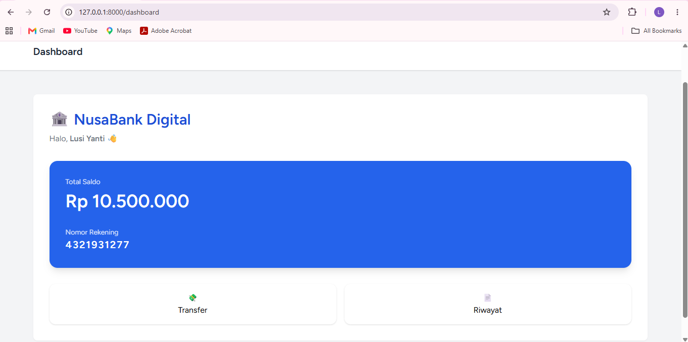

\# 🏦 NusaBank Digital — Digital Banking System

NusaBank Digital is a Laravel-based digital banking system that simulates basic banking services, including customer account management, fund transfer, transaction history, and administrator monitoring.

\## ✨ Features

\### 👤 Customer Features

\- Register and login

\- Automatic account creation

\- View account balance

\- Transfer funds between accounts

\- Transaction history

\### 👨‍💼 Admin Features

\- Admin dashboard

\- Monitor users

\- Monitor transactions

\- Role-based access control (RBAC)

\---

\## 📸 Application Preview

\### Customer Dashboard

\### Transfer Feature
!\[Transfer Feature](assets/transfer.png)

\### Transaction History
!\[Transaction History](assets/history.png)

\### Admin Dashboard
!\[Admin Dashboard](assets/admin-dashboard.png)

